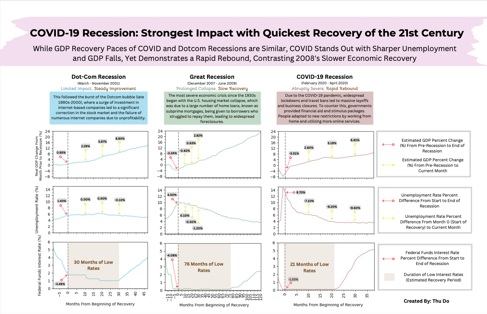

# Semester Project

Thu Do 

CS625: Data Visualization

## Datasets

*Link to Real Gross Domestic Product Data Source:* https://fred.stlouisfed.org/series/GDPC1 or [GDPC1.csv](https://github.com/Thustepsforward/Recession-Visualization/blob/main/GDPC1.csv)

*Link to Federal Funds Interest Rates Data Source:* https://fred.stlouisfed.org/series/FEDFUNDS or [FEDFUNDS.csv](https://github.com/Thustepsforward/Recession-Visualization/blob/main/FEDFUNDS.csv)

*Link to Unemployment Rate Data Source:* https://fred.stlouisfed.org/series/UNRATE or [unemployment-rate.csv](https://github.com/Thustepsforward/Recession-Visualization/blob/main/unemployment-rate.csv)

All of the data was obtained from the Federal Reserve Bank of St. Louis's website, which is particularly known for its FRED database containing a wide range of economic time series data. The federal funds interest rate, unemployment rate, and real GDP are key economic indicators that provide insights into an economy's health and performance. 
Real GDP represents the total value of goods and services produced, adjusted for inflation, offering a measure of economic output  on a quarterly basis. The federal funds interest rate, controlled by the central bank, influences borrowing costs and economic activity. 
Lower rates stimulate economic growth, while higher rates can help control inflation. The unemployment rate reveals the percentage of people actively seeking employment within the labor force, offering a snapshot of labor market conditions.
A high unemployment rate may indicate economic distress, while a low unemployment rate may suggest a strong job market.

## Final Question

### **Which 21st-century recession demonstrated the greatest economic impact and the fastest recovery based on real GDP, unemployment rate, and federal funds interest rate?**

## Final Chart

Link to Final Chart:

[PDF version (Download for Better Quality)](https://github.com/Thustepsforward/Recession-Visualization/blob/main/CS625-Final-Visualization.pdf)

[PNG version](https://github.com/Thustepsforward/Recession-Visualization/blob/main/CS625-Final-Vis-Image.png)

## Idiom: Line Chart

Idiom: Line Chart / Mark: Points connected by Lines
| Data: Attribute | Data: Attribute Type  | Encode: Channel | 
| --- |---| --- |
| Months From Beginning of Recovery | key, ordered | horizontal spatial region (x-axis) |
| Real GDP Change From Month Prior to Recession (%) | value, quantitative | vertical spatial region (y-axis) |
| Unemployment Rate (%) | value, quantitative | vertical spatial region (y-axis) |
| Federal Funds Interest Rate (%) | value, quantitative | vertical spatial region (y-axis) |
| Dot-Com, Great, & COVID-19 Recession | value, categorical | color hue |

## How the Final Chart Answers the Question

My facet chart helps the audience determine which recession had the greatest economic impact by highlighting the decline or growth of each economic indicator from the start to the end of the recession through changes on the line charts (before the dashed line) and the red arrows. The red arrows offer a concise overview of the changes in economic indicators from the beginning to the end of the recession, eliminating the need for the audience to perform any mental calculations based on the y-axis. By using the red arrows, the audience can see that the COVID-19 recession, despite being the shortest of the three, had the most significant impact on the real GDP and unemployment rate.

By examining the changes on the line charts (after the dashed line) and the yellow arrows, the audience can determine that the COVID-19 recession had the fastest recovery in terms of length (duration of low-interest rates) and recovery rate (considering both unemployment rate & real GDP) compared to the other 21st century recessions. The yellow arrows allow a fair comparison of the recession's recovery path by highlighting changes from the first month of the recovery period to the 10th, 20th, and 30th months after the recession. One interesting finding was that the GDP recovery rate of the Dot-Com and COVID-19 recessions were very similar to each other despite the COVID-19 recession having the biggest decline in Real GDP during the recession. In addition, the Great Recession had the second-largest Real GDP decline and the slowest recovery among the three recessions.

The second row in the facet chart reveals that the COVID-19 recession had the most significant rise in the unemployment rate during the recession phase and the fastest decline in the unemployment rate during the recovery period. In contrast, the Great Recession had a more moderate effect, with a 4.5% increase in the unemployment rate during the recession phase and a slow recovery, as indicated by the yellow markers each showing less than a 2% change. The unemployment rate experienced minimal change following the Dotcom Recession, as indicated by the yellow arrows showing variations below 0.5%. This stability reflects the recession's limited impact on unemployment, which saw only a 1.4% increase. Using the duration of low-interest rates as the estimated recovery period (shaded brown area), the audience can see that COVID-19's recovery was the shortest at 21 months, compared to the Dot-Com recession's 30 months and the Great Recession's 76 months.

To summarize, the data depicted in this facet chart demonstrates the unique nature of the COVID-19 recession. It stands out as the recession with the most significant economic impact in the 21st century, marked by sharp declines in GDP and unemployment rates. However, it also distinguishes itself with an unprecedentedly rapid recovery, as evidenced by the quick rebound in these key economic indicators. This stark contrast with the slower recovery of the Great Recession highlights the unique economic characteristics of the COVID-19 period.

## Final Thoughts

My facet chart helps the audience determine which recession had the greatest economic impact by highlighting the decline or growth of each economic indicator from the start to the end of the recession through changes on the line charts (before the dashed line) and the red arrows. The red arrows offer a concise overview of the changes in economic indicators from the beginning to the end of the recession, eliminating the need for the audience to perform any mental calculations based on the y-axis. By using the red arrows, the audience can see that the COVID-19 recession, despite being the shortest of the three, had the most significant impact on the real GDP and unemployment rate.

By examining the changes on the line charts (after the dashed line) and the yellow arrows, the audience can determine that the COVID-19 recession had the fastest recovery in terms of length (duration of low-interest rates) and recovery rate (considering both unemployment rate & real GDP) compared to the other 21st century recessions. The yellow arrows allow a fair comparison of the recession's recovery path by highlighting changes from the first month of the recovery period to the 10th, 20th, and 30th months after the recession. One interesting finding was that the GDP recovery rate of the Dot-Com and COVID-19 recessions were very similar to each other despite the COVID-19 recession having the biggest decline in Real GDP during the recession. In addition, the Great Recession had the second-largest Real GDP decline and the slowest recovery among the three recessions.

The second row in the facet chart reveals that the COVID-19 recession had the most significant rise in the unemployment rate during the recession phase and the fastest decline in the unemployment rate during the recovery period. In contrast, the Great Recession had a more moderate effect, with a 4.5% increase in the unemployment rate during the recession phase and a slow recovery, as indicated by the yellow markers each showing less than a 2% change. The unemployment rate experienced minimal change following the Dotcom Recession, as indicated by the yellow arrows showing variations below 0.5%. This stability reflects the recession's limited impact on unemployment, which saw only a 1.4% increase. Using the duration of low-interest rates as the estimated recovery period (shaded brown area), the audience can see that COVID-19's recovery was the shortest at 21 months, compared to the Dot-Com recession's 30 months and the Great Recession's 76 months.
To summarize, the data depicted in this facet chart demonstrates the unique nature of the COVID-19 recession. It stands out as the recession with the most significant economic impact in the 21st century, marked by sharp declines in GDP and unemployment rates. However, it also distinguishes itself with an unprecedentedly rapid recovery, as evidenced by the quick rebound in these key economic indicators. This stark contrast with the slower recovery of the Great Recession highlights the unique economic characteristics of the COVID-19 period.

## References

1. "Two Recessions, Two Recoveries" : https://www.pewresearch.org/social-trends/2019/12/13/two-recessions-two-recoveries/
2. "Chart Book: Tracking the Recovery From the Pandemic Recession" : https://www.cbpp.org/research/economy/tracking-the-recovery-from-the-pandemic-recession
3. "Chart Book: Tracking the Post-Great Recession Economy" : https://www.cbpp.org/research/economy/tracking-the-post-great-recession-economy
4. "The Great Recession" : https://www.federalreservehistory.org/essays/great-recession-of-200709
5. "Chart Book: Tracking the Recovery From the Pandemic Recession" : https://www.cbpp.org/research/economy/tracking-the-recovery-from-the-pandemic-recession 
